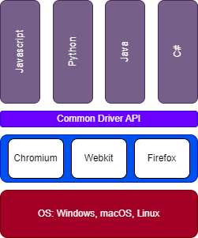

# <!--fit-->Testing with Playwright
## Chris Ayers

---

# Chris Ayers
## Senior Customer Engineer Microsoft

<i class="fa-brands fa-twitter"></i> Twitter : @Chris\_L\_Ayers
<i class="fa-brands fa-mastodon"></i> Mastodon: @Chrisayers@hachyderm.io
<i class="fa-brands fa-linkedin"></i> LinkedIn: [chris\-l\-ayers](https://linkedin.com/in/chris-l-ayers/)
<i class="fa fa-window-maximize"></i> Blog: [https://chris-ayers\.com/](https://chris-ayers.com/)
<i class="fa-brands fa-github"></i> GitHub: [Codebytes](https://github.com/codebytes)

---

# Agenda

- What is Testing?
- What is Playwright?
- Benefits of Using Playwright
- Setting up a React Project
- Creating End-to-End Tests with Playwright
- Integrating with Continuous Integration

---

# What is Testing?

---

**Testing is** the ***systematic process*** of **verifying** and **validating** that a software application or system meets specified requirements and functions correctly.

---

## Purpose

- **Detect Errors**: Identify bugs and discrepancies before a product reaches end-users.
- **Enhance Quality**: Deliver a reliable and efficient product.
- **Reduce Costs**: Addressing defects early is often cheaper than remedying issues later.
- **Increase User Satisfaction**: A well-tested product ensures a better user experience.

---

## Types of Testing

- Unit Testing
- Integration Testing
- System Testing
- Acceptance Testing

- End-to-End (E2E) Testing
- Accessibility Testing
- Visual Testing
- Component Testing

---

# End-to-End Testing

- Validate the flow of an application as a user would.

---

# Snapshot Testing

- Capture screenshots or page content.
- Compare against known states to detect visual changes.

---

# Interaction Testing

- Simulate user interactions like clicks, form inputs, and scrolls.

---

# Accessibility Testing

- Evaluate your application's accessibility features.
- Ensure it's user-friendly for all audiences.

---

# Performance Testing

- Analyze page load times and rendering performance.
- Identify bottlenecks and optimization opportunities.

---

# Testing Challenges

- Testing is **hard**
- Testing takes **time to learn**
- Testing **time to build**
- **Testing culture**

- Tests are **slow**
- Tests are **brittle**
- Tests are **flaky**

---

# Testing Best Practices

- Test user-visible behavior
- Make tests as isolated as possible
- Avoid testing third-party dependencies
- Testing with a database

---

# What is Playwright?
- Open Source released by Microsoft in 2020
- A Modern web test framework
- Can test APIs
- Works with Headless or Headed Browsers
  - Chromium - Chrome/Edge
  - Firefox
  - WebKit

---

# Language Support

- Bindings for:
  - Python
  - Javascript/Typescript
  - Java
  - .NET

---

---

# Playwright Architecture

- Language Bindings
- Single Automation Protocol
- Abstracts debugging protocols
  - Native browser debugging protocols

---

|  | Playwright | Selenium | Cypress |
|---|---|---|---|
| Language Bindings | TypeScript/JavaScript, Python, Java, C# | C#, Java, JavaScript, Ruby, Python | JavaScript |
| Browser support | Chromium, Firefox, Webkit | All major full browsers | Chrome, Edge, Firefox, Electron |
| Browser Control Technology | Debug Protocols | WebDriver Protocol | In-browser JavaScript |

---

# Benefits of Using Playwright

---

# Reliable & Stable

- Automatically waits for UI to be ready.
- Handles dynamic content, animations, and AJAX requests gracefully.
- Minimizes flaky tests.

---

# Mobile Emulation

- Easily emulate various mobile devices.
- Test responsiveness and mobile-specific features.
- Ability to emulate location via geolocation

---

# Advanced Interactions

- Network request interception.
- Create custom scenarios (e.g., offline mode, slow network).

---

# Native Context Automation

- Automate beyond the browser:
  - Upload & download files
  - Work with iframes and shadow DOM

---

# Fast Execution

- Tests are executed swiftly, reducing waiting time.
- Parallel test execution.
- Optimal performance due to its architecture.

---

# Rich Tooling Ecosystem

- VS Code Extension
- Integrations with popular CI/CD services.
- Compatible with multiple assertion libraries.

---

# Playwright Best Practices

- Use locators
  - Use chaining and filtering
  - Prefer user-facing attributes to XPath or CSS selectors
- Generate locators
  - Use codegen to generate locators
  - Use the VS Code extension to generate locators
- Use web first assertions
  - Don't use manual assertions

---

# Playwright Best Practices

- Configure debugging
  - Local debugging
  - Debugging on CI
- Use Playwright's Tooling
- Test across all browsers
- Keep your Playwright dependency up to date
- Run tests on CI
- Lint your tests
  - Use parallelism and sharding

---

# DEMOS

---

---

# Microsoft Playwright Testing

Join the waitlist for Microsoft Playwright Testing private preview
• New Azure service for running Playwright tests.
• Cloud enabled to run Playwright tests at scale.
• High parallelization across operating system-browser combinations.
• Get tests done much faster.
• Speed up delivery of features without sacrificing quality.
Private Preview
To learn more about Microsoft Playwright Testing, refer to https://aka.ms/mpt/private-preview-blog.

---

# Questions?

---

## Resources

#### GitHub Repo
#### https://github.com/codebytes/testing-with-playwright

#### Playwright website
#### https://playwright.dev/

## Contact

<i class="fa-brands fa-twitter"></i> Twitter: @Chris\_L\_Ayers
<i class="fa-brands fa-mastodon"></i> Mastodon: @Chrisayers@hachyderm.io
<i class="fa-brands fa-linkedin"></i> LinkedIn: - [chris\-l\-ayers](https://linkedin.com/in/chris-l-ayers/)
<i class="fa fa-window-maximize"></i> Blog: [https://chris-ayers\.com/](https://chris-ayers.com/)
<i class="fa-brands fa-github"></i> GitHub: [Codebytes](https://github.com/codebytes)

