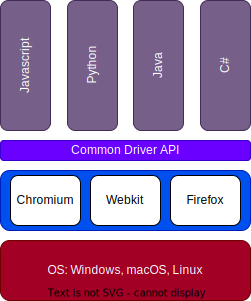
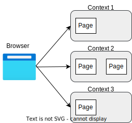
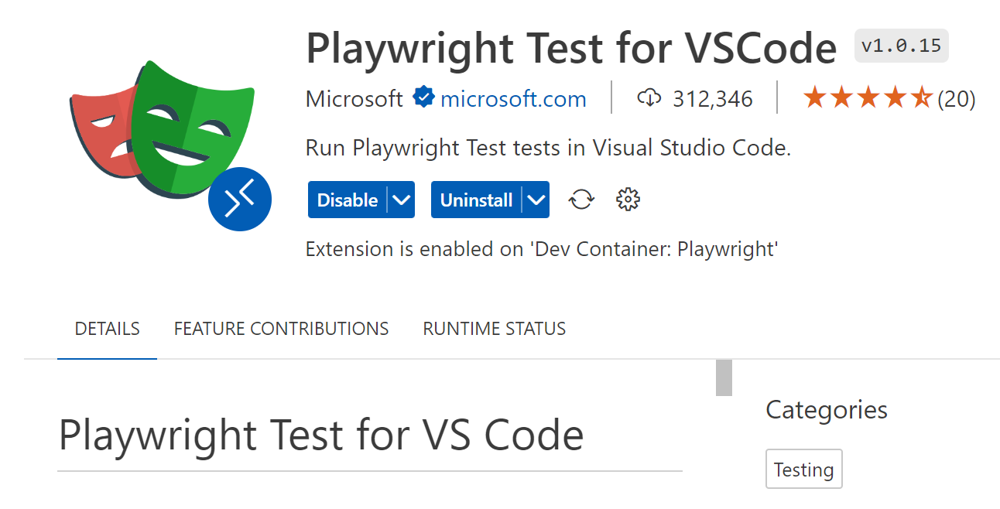
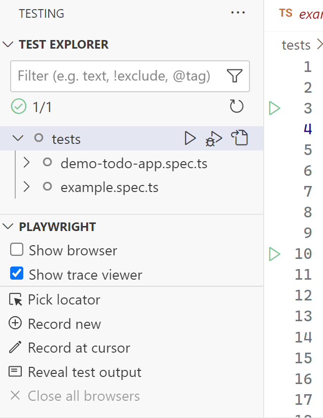
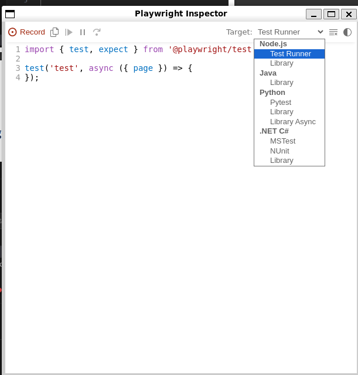
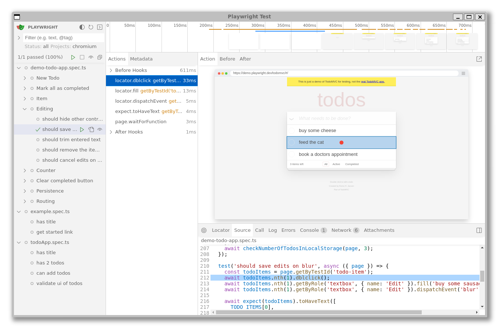
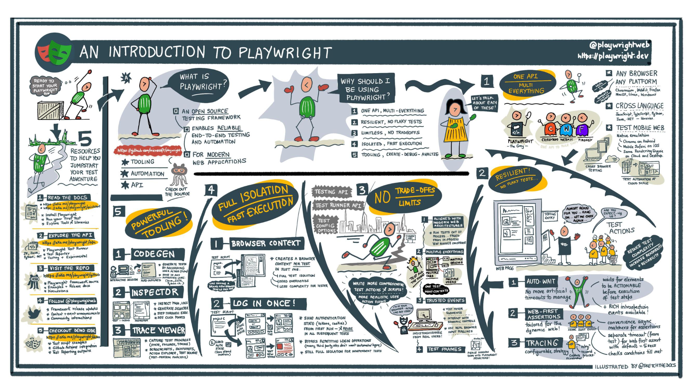
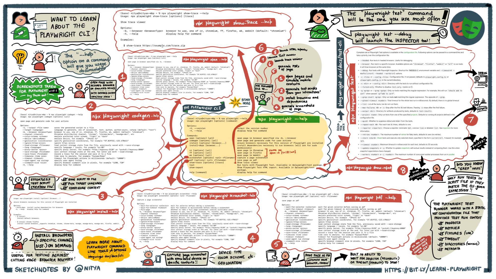

# <!--fit-->Testing with<br/>Playwright
## Chris Ayers


---


# Chris Ayers
## Senior Customer Engineer<br>Microsoft

<i class="fa-brands fa-twitter"></i> Twitter : @Chris\_L\_Ayers
<i class="fa-brands fa-mastodon"></i> Mastodon: @Chrisayers@hachyderm.io
<i class="fa-brands fa-linkedin"></i> LinkedIn: [chris\-l\-ayers](https://linkedin.com/in/chris-l-ayers/)
<i class="fa fa-window-maximize"></i> Blog: [https://chris-ayers\.com/](https://chris-ayers.com/)
<i class="fa-brands fa-github"></i> GitHub: [Codebytes](https://github.com/codebytes)

---

# Agenda

- What is Testing?
- What is Playwright?
- Benefits of Using Playwright
- Creating End-to-End Tests with Playwright
- Integrating with Continuous Integration

---

# What is Testing?

---

**Testing is** the ***systematic process*** of **verifying** and **validating** that a software application or system meets specified requirements and functions correctly.

<!-- ## Purpose

- **Detect Errors**
- **Enhance Quality**
- **Reduce Costs**
- **Increase User Satisfaction** -->

---

## Types of Testing

<div class="columns">
<div>

- Unit Testing
- Integration Testing
- System Testing
- Acceptance Testing

</div>
<div>

- End-to-End (E2E) Testing
- Accessibility Testing
- Visual Testing
- Component Testing

</div>
</div>

---

# UI Testing Best Practices

- Test user-visible behavior
- Make tests as **isolated** as possible
- Avoid testing third-party dependencies
- If you test with a database, **control** the data

---

# Testing Challenges

<div class="columns">
<div>

- Testing is **hard**
- Testing takes **time to learn**
- Testing **time to build**
- **Testing culture**

</div>
<div>

* Tests are **slow**
* Tests are **brittle**
* Tests are **flaky**

</div>
</div>

---

# Lets try to make testing easier... with 


---


# What is Playwright?
- ### **Open Source** released by <i class="fa-brands fa-microsoft"></i> Microsoft in 2020
- A Modern web test framework
- Works with Headless or Headed Browsers
  - <i class="fa-brands fa-chrome"></i> Chromium - Chrome/Edge
  - <i class="fa-brands fa-firefox"></i> Firefox
  - <i class="fa-brands fa-safari"></i> WebKit

---

# Language Support

- Bindings for:
  - Python
  - Javascript/Typescript
  - Java
  - .NET

---



# Playwright Architecture

- Language Bindings
- Single Automation Protocol
- Abstracts debugging protocols

---

# Benefits of Using Playwright

---

# Reliable & Stable

- Automatically waits for UI to be ready.
- Handles dynamic content, animations, and AJAX requests gracefully.
- Minimizes flaky tests.
- Isolation with Browser Contexts

---

# Browser Contexts

Browser Contexts provide a way to operate multiple independent browser sessions.

If a page opens another page, e.g. with a window.open call, the popup will belong to the parent page's browser context.



---

# Mobile Emulation

- Easily emulate various mobile devices.
  - Mobile Chrome
  - Mobile Safari
  - Emulate Viewports and Scale
- Test responsiveness and mobile-specific features.
- Ability to emulate location via geolocation


---

# Advanced Interactions

- Network request interception.
- Create custom scenarios (e.g., offline mode, slow network).
- API Mocking
  - HAR file support


---

# Native Context Automation

<div class="columns">
<div>

- Automate beyond the browser:
  - Upload & download files
  - Work with iframes and shadow DOM

</div>
<div>

```ts
// Get frame using the frame's name attribute
const frame = page.frame('frame-login');

// Get frame using frame's URL
const frame = page.frame({ url: /.*domain.*/ });

// Interact with the frame
await frame.fill('#username-input', 'John');
```

</div>
</div>

---

# Fast Execution

- Tests are executed swiftly, reducing waiting time.
- Parallel test execution.
- Optimal performance due to its architecture.
- Isolation with Browser Contexts
  
---

# Auto-Waiting
For example, for *page.click()*, Playwright will ensure that:

- element is Attached to the DOM
- element is Visible
- element is Stable, as in not animating or completed animation
- element Receives Events, as in not obscured by other elements
- element is Enabled

#### See a full list of actions at: https://playwright.dev/docs/actionability

</div>
</div>

---

# Locators

| Method | Description |
|---|---|
| `page.getByRole()` | Locate by explicit and implicit accessibility attributes. |
| `page.getByText()` | Locate by text content. |
| `page.getByLabel()` | Locate a form control by associated label's text. |
| `page.getByPlaceholder()` | Locate an input by placeholder. |
| `page.getByAltText()` | Locate an element, usually image, by its text alternative. |
| `page.getByTitle()` | Locate an element by its title attribute. |
| `page.getByTestId()` | Locate an element based on its data-testid attribute. |

---

<style scoped>
/* Reset table styling provided by theme */
table, tr, td, th {
  /* all: unset; */

  /* Override contextual styling */
  /* border: 0 !important; */
  /* background: transparent !important; */
  font-size: 18px;
}
table { display: table; }
tr { display: table-row; }
td { display: table-cell; }
th { display: none; }
/* ...and layout freely :) */
table {
  width: 100%;
}
td {
  text-align: center;
  vertical-align: middle;
}
</style>

# Web-First Assertions

| | |
|---|---|
| expect(locator) | expect(locator/page/response) |
| expect(locator).toBeAttached() | expect(locator).toHaveClass()            |
| expect(locator).toBeChecked()  | expect(locator).toHaveCount()            |
| expect(locator).toBeDisabled() | expect(locator).toHaveCSS()              |
| expect(locator).toBeEditable() | expect(locator).toHaveId()               |
| expect(locator).toBeEmpty()    | expect(locator).toHaveJSProperty()       |
| expect(locator).toBeEnabled()  | expect(locator).toHaveScreenshot()       |
| expect(locator).toBeFocused()  | expect(locator).toHaveText()             |
| expect(locator).toBeHidden()   | expect(locator).toHaveValue()            |
| expect(locator).toBeInViewport() | expect(locator).toHaveValues()         |
| expect(locator).toBeVisible()  |  expect(page).toHaveTitle()          |
| expect(locator).toContainText() | expect(page).toHaveURL()             |
| expect(locator).toHaveAttribute() | expect(response).toBeOK()               |


---

# Visual evidence

<div class="columns">
<div>

- Screenshot support
- Video Recording

</div>
<div>

<video width="100%" autoplay loop muted>
  <source src="./img/playwright-video.mp4" type="video/mp4" />
  Your browser does not support the video tag.
</video>

</div>
</div>

---

# Rich Tooling Ecosystem

- VS Code Extension
- Integrations with popular CI/CD services.
- Compatible with multiple assertion libraries.

---

# Playwright Extension


---

# Integration with IDE Testing


---

# Codegen

Playwright Test Generator is a GUI tool that helps you record Playwright tests



---

# UI Mode
Run tests and visually see how it runs



---

# Playwright Best Practices

- Use locators
  - Use chaining and filtering
  - Prefer user-facing attributes to XPath or CSS selectors
- Generate locators
  - Use codegen to generate locators
  - Use the VS Code extension to generate locators
- Use web first assertions
  - Don't use manual assertions

---

# Playwright Best Practices

- Configure debugging
  - Local debugging
  - Debugging on CI
- Use Playwright's Tooling
- Test across all browsers
- Keep your Playwright dependency up to date
- Run tests on CI
- Lint your tests
  - Use parallelism and sharding

---

# DEMOS

---

# Microsoft Playwright Testing

Join the waitlist for Microsoft Playwright Testing private preview
• New Azure service for running Playwright tests.
• Cloud enabled to run Playwright tests at scale.
• High parallelization across operating system-browser combinations.
• Speed up delivery of features without sacrificing quality.

### Private Preview
To learn more about Microsoft Playwright Testing, refer to:
 https://aka.ms/mpt/private-preview-blog.

---

# Questions?


---

<div class="columns">
<div>

## Resources

#### GitHub Repo
[**https://github.com/codebytes/testing-with-playwright**](https://github.com/codebytes/testing-with-playwright)

#### Playwright website
[**https://playwright.dev/**](https://playwright.dev/)

</div>

<div>

## Contact

<i class="fa-brands fa-twitter"></i> Twitter: @Chris\_L\_Ayers
<i class="fa-brands fa-mastodon"></i> Mastodon: @Chrisayers@hachyderm.io
<i class="fa-brands fa-linkedin"></i> LinkedIn: - [chris\-l\-ayers](https://linkedin.com/in/chris-l-ayers/)
<i class="fa fa-window-maximize"></i> Blog: [https://chris-ayers\.com/](https://chris-ayers.com/)
<i class="fa-brands fa-github"></i> GitHub: [Codebytes](https://github.com/codebytes)

</div>
</div>

---

<!-- footer: '' -->



---
<!-- footer: '' -->


